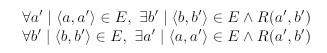
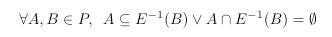
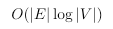
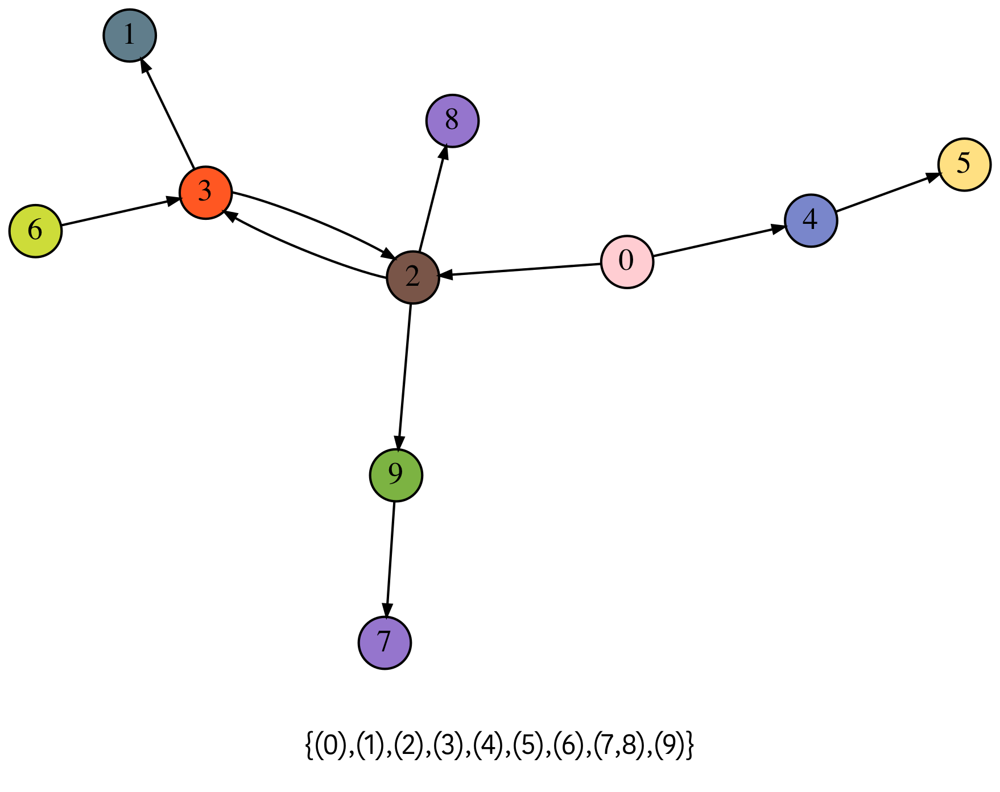
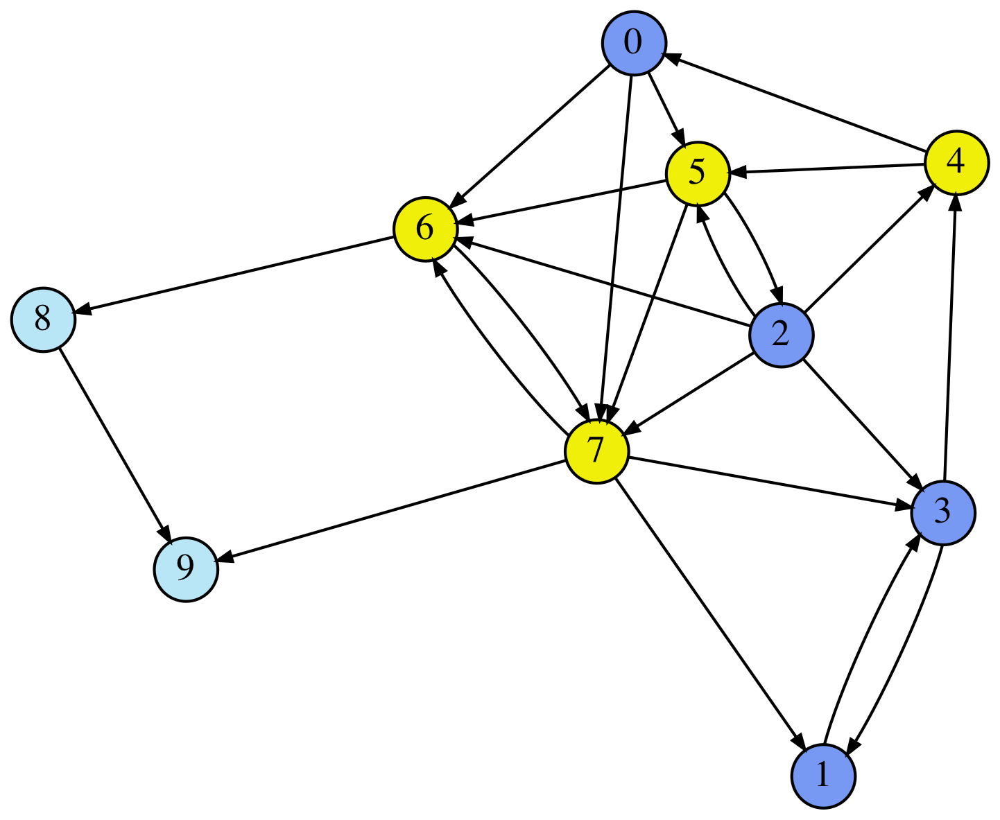
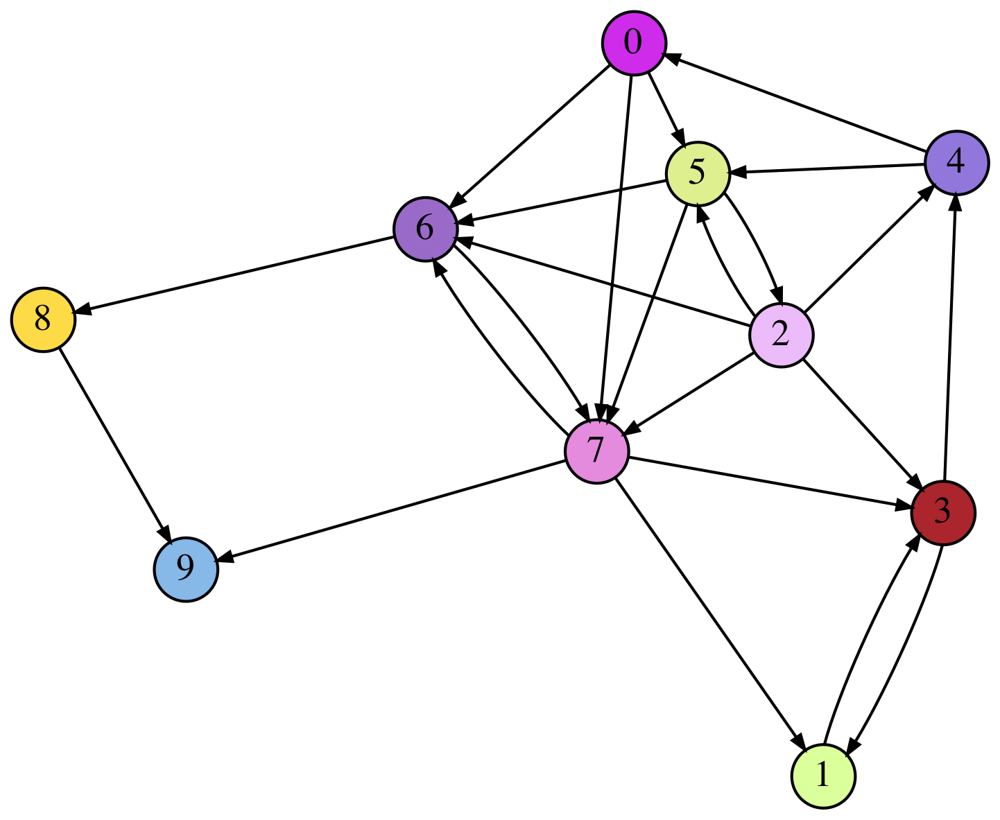

 <a href='https://coveralls.io/github/fAndreuzzi/Bisimulation-Algorithms'></a>
 [](https://github.com/Naereen/StrapDown.js/blob/master/LICENSE) 

# Bisimulation-Algorithms

## The problem
Let's consider a directed graph G=(V,E). A *bisimulation* on G is a binary relation on V which satisfies the following property:



This is in fact a condition on the *behavior* of the nodes: two nodes *behave* in the *same way* if for each node reached by one of them, there's a fourth node reached by the other node which *behaves* like the third.

This informal definition of bisimulation is equivalent to the formal one above, but it's somewhat more explicit.

## Algorithmic approach
The somewhat recursive statement of the problem makes the bisimulation an apparently difficult problem from an algorithmic point of view. However, as Kanellakis C. and Smolka S. shown in their paper published in 1990, computing the *maximum* bisimulation of a graph (namely the *biggest* bisimulation, the one which relates the highest number of nodes) is equivalent to determining the *relational stable coarsest partition*.

The *RSCP* of a set S given a binary relation R, as the name suggests, is the *coarsest* (which contains the fewest number of blocks) *stable partition*, where *stability* is a quality of partitions defined as follows for a given partition P:



This statemente is reassuring: in order to verify that two nodes are *bisimilar* (which is quite interesting for the applications) we do not need to visit exhaustively their children, and then the children of the children, and so on. We only need to compute the RSCP of V with respect to the relation E, and check whether the two nodes are in the same block.

## Algorithms
This library contains the implementation in Python 3 of the following algorithms:
|  Name        |  Strategy   | Complexity  |
|--------------|:-------------:|:---:|
| Paige-Tarjan | Negative    |   |
| Dovier-FBA   | Negative    |   |
| Saha         | Incremental |  Depends on the entity of the changes. |

## Installation
The package isn't published, therefore the following steps are needed:
1. Open a terminal window;
2. Navigate to a suitable directory;
3. Clone the repository: `git clone https://github.com/fAndreuzzi/Bisimulation-Algorithms.git`;
4. Open the new directory `cd Bisimulation-Algorithms`;
5. Install the package in development mode: `pip install -e ./` or `pip3 install -e ./`.

## Usage
This example shows how to use the PTA algorithm on a given graph. We use [NetworkX](https://networkx.org/) to represent the input. Moreover, we need the initial partition, represented as an iterable of iterables: inner iterables are the blocks of the partition.

Therefore the following snippet:
```python
graph = nx.DiGraph()
graph.add_nodes_from(range(5))
graph.add_edges_from([...])

initial_partition = [[0,1], [2,3], [4]]
```
intializes a graph with 5 nodes (from 0 to 4), some edges, and whose nodes are initially splitted in three different blocks.

We can find the RSCP with the Paige-Tarjan Algorithm as follows:
```python
import paige_tarjan.pta_algorithm as pta
rscp = pta.rscp(graph, initial_partition)
```
The RSCP is a set of tuples.

## Examples
Initial partition | RSCP
--- | ---
 | 
 | 

## Applications
Work in progress.
