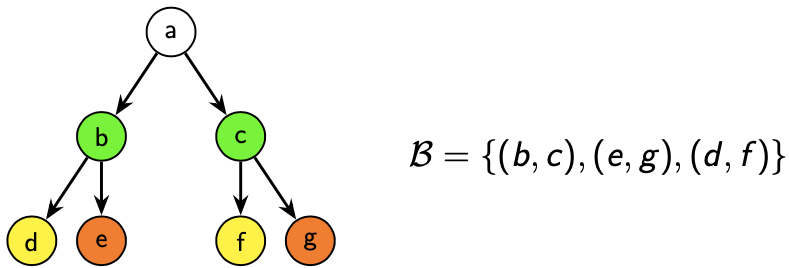

A brief introduction to bisimulation
====================================

In this page we provide a very brief introduction to bisimulation. The
interested reader may found an in-depth discussion in the following paper::

    Gentilini, Raffaella, Carla Piazza, and Alberto Policriti.
    "From bisimulation to simulation: Coarsest partition problems."
    Journal of Automated Reasoning 31.1 (2003): 73-103.

**Definition and implications**

Given a graph :math:`G = (V,E)`, a *bisimulation* :math:`\mathcal{B}` is a
binary relation on :math:`V` which satisfies the following condition:

.. math::

    (a,b) \in \mathcal{B} \implies \begin{cases}
        \forall a' \mid \langle a,a' \rangle \in E, \,\, \exists b' \mid \langle b,b' \rangle \in E \land (a',b') \in \mathcal{B}\\
        \forall b' \mid \langle b,b' \rangle \in E, \,\, \exists a' \mid \langle a,a' \rangle \in E \land (a',b') \in \mathcal{B}
    \end{cases}

Which can be read as follows: given a couple of nodes which is in relation
with respect to :math:`\mathcal{B}`, each child of the first node is in
relation with at least one child of the second node, and viceversa.

The following image shows an example of a bisimulation:

In the image you can observe an interesting property of bisimulation: two
*bisimilar* nodes (namely two nodes in relation for at least one bisimulation
on the graph) *behave* in a similar way. This is equivalent to saying that all
their children behave in a similar way, which is exactly the condition stated
above. Let's look at another example:

.. image:: _static/bisimulation_example_2.png

Again, the two nodes are almost indistinguishable: we may switch :math:`b` and
:math:`b`, and unless :math:`a` resents the node :math:`c` for some reason
nobody would notice. This is a consequence of the fact (which can be proved)
that two bisimilar nodes represent the same set.

If you are convinced of the last statements, it is easy to convince that
the maximum bisimulation (namely the bisimulation which contains all
the bisimulations of the graph) tells us a lot about the nodes and how they
behave. First of all, the maximum bisimulation is an equivalence relation,
therefore it divides the set of nodes in equivalence classes of *bisimilar*
nodes. Moreover, its equivalence classes are the maximal sets of *bisimilar*
nodes (this wasn't true in the first image, since as you can see nodes
:math:`d,g` are bisimilar, but are not in relation with respect to
:math:`\mathcal{B}`).

**Applications**

Maximum bisimulation may be used to find equivalent nodes (a task which has
a lot of applications in **concurrency theory** and **indexing** of
semi-structured datasets, for instance) or to minimize the graph (by collapsing
each equivalence class into a single node) while preserving the information
conveyed by the graph.

**Equivalence with RSCP**

It can be shown that finding the maximum bisimulation is equivalent to finding
the *Relational Stable Coarsest Partition* (RSCP) of the set :math:`V` with
respect to the relation :math:`E`. This problem consists in finding the
coarsest (i.e. the one with fewer blocks) **stable** partition of the set
:math:`V`, where stable means that for each couple of blocks :math:`B_1,B_2`
the following condition holds:

.. math::

    B_1 \subseteq E^{-1}(B_2) \lor B_1 \cap E^{-1}(B_2) = \emptyset.

This equivalence is widely exploited since the RSCP problem is easier to
express algorithmically.
