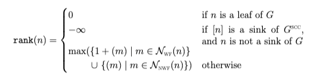
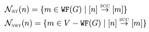

Notation and terms
==================

In this documentation we use some notation which may not be standard. This page
serves as a reference.

Note that we **always** refer to *directed* graphs, namely graphs such that the edge relation is not symmetric in general.

Graphs
------

* The symbol ":math:`G`" represents a graph. A graph is the couple of a set of nodes :math:`V` and a binary relation :math:`E` which is usually called "set of edges";
* We use interchangeably the terms *vertex* and *node* when we refer to the members of the set :math:`V`;
* The symbol ":math:`\langle a,b \rangle`" means "an edge from the vertex :math:`a` to the vertex :math:`b`;
* The symbol ":math:`E(\{x\})`", :math:`x \in V`, or the *image* of the vertex :math:`x`, represents the set :math:`\{y \in V \mid \langle x,y \rangle\}`;
* The symbol ":math:`E^{-1}(\{x\})`", :math:`x \in V`, or the *counterimage* of the vertex :math:`x`, represents the set :math:`\{y \in V \mid \langle y,x \rangle\}`;
* A node :math:`x` is *well-founded* if it is not possible to reach a cycle following the edges from :math:`x`;
* The symbol ":math:`\texttt{WF}(G)`" is the *well-founded* part of the graph, namely the subset of :math:`V` which is made only of *well-founded* nodes;
* A **DFS** (acronym for *Depth-First-Search*) is one of the possible ways to visit a graph;
* A *strongly connected component* (SCC) is a subset of :math:`V` such that each node in the component is reachable from all the others;
* The graph of *strongly connected components* of :math:`G`, whose symbol is :math:`G^{\textit{SCC}}`, is the graph whose vertexes are the SCCs of :math:`G`.

For a reference on graphs check [1]_.

Paige-Tarjan's notation
-----------------------

* The symbol ":math:`Q`" usually refers to a partition of the set :math:`V` (nodes of a graph :math:`G`);
* The symbol ":math:`X`" usually refers to a partition of the blocks of the partition ":math:`Q`" (namely ":math:`X`" contains blocks of blocks).

.. _Rank definition:

Dovier-Piazza-Policriti's notation
----------------------------------

The *rank* of a node is defined as follows:

where we used the following sets to simplify the defintion:

Saha's notation
---------------

A *causal splitter* for two blocks :math:`A,B` is a block :math:`C` such that:

.. math::

    (A \to C \land B \not\to C) \lor (A \not\to C \land B \to C)

which means that such a block may prevent the two blocks to be merged if we
want to obtain a **stable** partition.

**Bibliography**

.. [1] Cormen, Thomas H., et al. Introduction to algorithms. MIT press, 2009.
